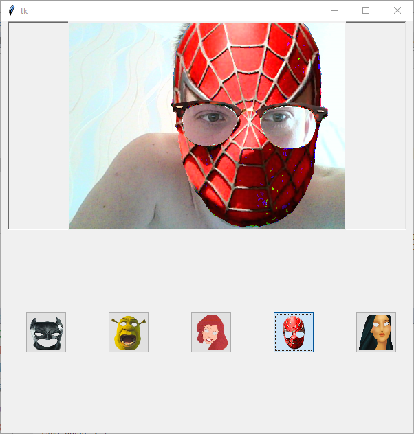

## Cartoon faces ##
Сейчас очень бысто набирают популярность приложения, которые как-то изменяют твое лицо. Либо это состаренность/молодость, либо это пририсовка к тебе ушей/усов и прочего. Хотелось бы сделать, что-то похожее на [это](http://www.europaplus.ru/index.php?go=News&in=view&id=29635)

## Зависимости ##
* python 3
* dlib
* imutils
* opencv-python
* numpy

PS: Можно использовать Makefile в котором прописаны некоторые зависимости

## Как запустить ##

- **Приложение для отрисовки**: `python3 main.py`
- **Приложение для разметки:** `python3 markup/markup.py`

## Известные баги ##

